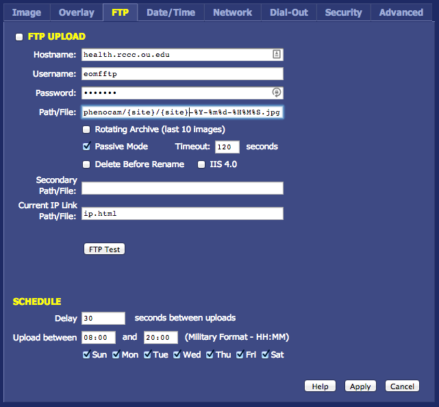

# Phenocam config for StarDot Cameras

## Make directory for {site}

On `mangrove.rccc.ou.edu` you'll need to create a directory named for the
`{site}` in `/home/eomfftp/phenocam`.  


## FTP Settings

Set the FTP settings as follows:



Notice that you DO NOT WANT to check the FTP UPLOAD checkbox.

Replace the PATH {site} sections with the site name (eg Elreno_ICOS_A) and
ensure the time and date format is set to: `%Y-%m%d-%H%M%S`.


## Date/Time
Set to Automatic with the server: `24.56.178.140`

## Network 

* DHCP
* Set Hostname: to the same string as {site} above.

## Advanced -> Manual Config

This configuration step ensures that the camera will upload its files
periodically throughout the day at: 8:30, 10:00, 10:30, 12:00, 13:30, 14:00,
16:00 and 18:00.

1. Edit `crontab`
2. Add lines to crontab:

```
00 08 * * * admin /bin/ftpscript /etc/config/ftp0.scr
00 10 * * * admin /bin/ftpscript /etc/config/ftp0.scr
30 10 * * * admin /bin/ftpscript /etc/config/ftp0.scr
00 12 * * * admin /bin/ftpscript /etc/config/ftp0.scr
30 13 * * * admin /bin/ftpscript /etc/config/ftp0.scr
00 14 * * * admin /bin/ftpscript /etc/config/ftp0.scr
00 16 * * * admin /bin/ftpscript /etc/config/ftp0.scr
00 18 * * * admin /bin/ftpscript /etc/config/ftp0.scr
```


